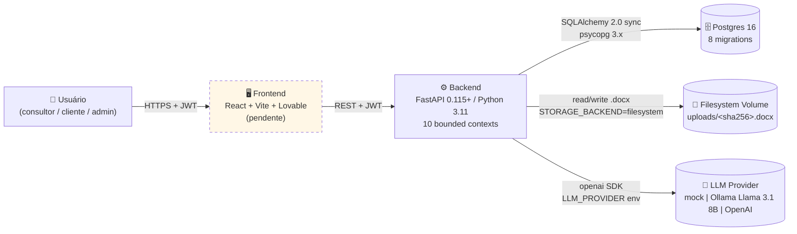
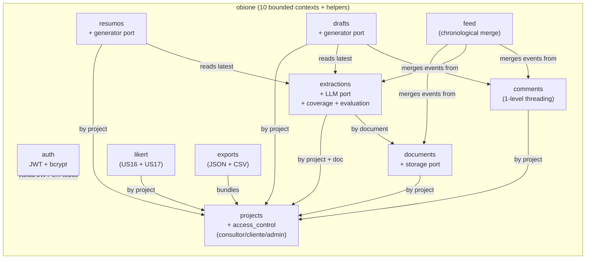
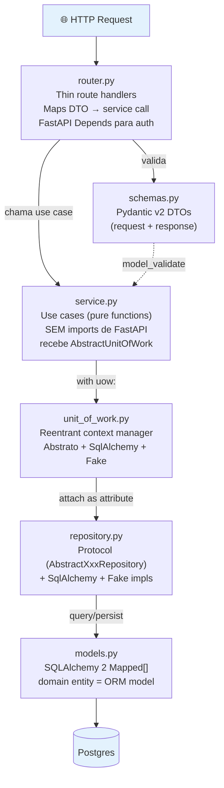
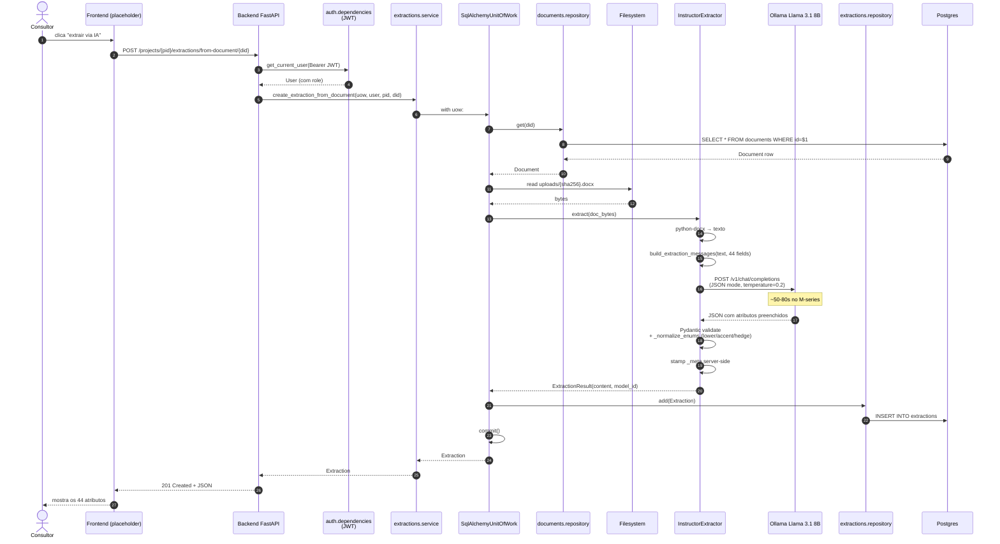
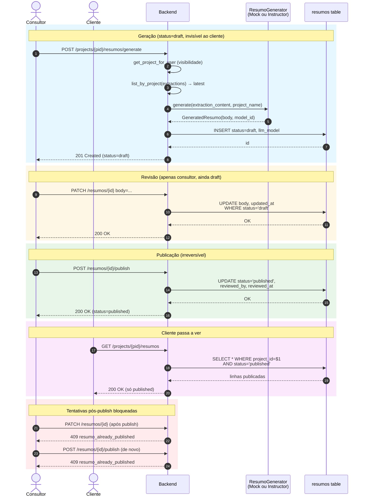

# ObiOne — Diagramas de Arquitetura

> Companion visual dos docs [`arquitetura_backend.md`](arquitetura_backend.md) (spec autoritativa) e [`arquitetura_pipeline.md`](arquitetura_pipeline.md) (decisões do pipeline LLM). Todos os diagramas são Mermaid — o GitHub renderiza nativamente.

---

## 1. Contexto do sistema (deployment view)

Quem fala com quem, e onde os dados moram. O frontend está pendente (Bruno); todo o resto está em produção local via `docker-compose`.

**Notas:**
- Frontend rodaria em `localhost:5173` (Vite); CORS já configurado.
- Postgres em container, porta `5435:5432` no host (evita conflito com outros DBs locais).
- LLM provider via env: `mock` (default em testes), `ollama/<model>` ou `openai/<model>`.

---

## 2. Bounded contexts (modelagem por domínio)

Cada caixa = pacote Python independente em `backend/src/obione/`. Setas = "X invoca Y através do UoW". O grafo é majoritariamente em estrela em torno de `projects` porque o conceito de projeto é a raiz semântica do observatório.

**Princípios:**
- **Projects** é a raiz de visibilidade — `get_project_for_user(uow, user, project_id)` é o ponto único de check de acesso, reusado por todos os contextos.
- **Resumos** e **Drafts** seguem o mesmo shape (port + adapter + lifecycle draft→published) porque são variações do mesmo padrão "IA propõe, consultor revisa, cliente vê só o publicado".
- **Feed** e **exports** são read-only — não definem tabelas próprias, só consolidam dados dos outros contextos.

---

## 3. Camadas dentro de um bounded context

Pragmatic clean architecture. Cada caixa é um arquivo Python; as setas vão sempre no sentido `router → service → uow → repository → models → DB`. Nenhuma seta atravessa para trás (`service.py` nunca importa FastAPI; `models.py` nunca conhece HTTP).

**Invariantes que valem em TODO bounded context:**
1. **Router nunca tem if/else de regra de negócio** — se aparecer, refatore para `service.py`.
2. **Service.py nunca importa FastAPI** — recebe `AbstractUnitOfWork`, retorna entidades de domínio ou `None`.
3. **UoW é reentrante** — `with uow:` aninhado reusa a sessão da chamada externa (evita `InvalidRequestError`).
4. **`expire_on_commit=False` + `eager_defaults=True`** — ORM objects ficam legíveis depois do `commit()`.

---

## 4. Fluxo de extração via LLM (US05)

Sequência completa quando o consultor clica "extrair via IA" para um `.docx` previamente uploaded.

**Tempos observados (Ollama Llama 3.1 8B, M-series):**
- Leitura `.docx` + montagem do prompt: <100ms
- Chamada LLM: 46-80s por documento
- Validação Pydantic + persistência: <200ms

---

## 5. Lifecycle de Resumo do Cliente (US12)

Resumo é gerado pela IA em `draft`, editado pelo consultor, e só vira visível pro cliente após `publish`. Publish é **irreversível**.

**Drafts (US13) seguem o mesmíssimo shape**, com duas diferenças:
- `generate` retorna **N items** num batch (não 1)
- Cada item tem `kind ∈ {next_step, attention_point}` e `DELETE` é permitido enquanto draft

---

## 6. Como navegar o código

Mapa rápido de onde cada conceito vive (relativo a `backend/src/obione/`):

| Conceito | Caminho |
|---|---|
| App entrypoint (FastAPI) | `main.py` |
| Settings (Pydantic + .env) | `settings.py` |
| Database Base + Session | `shared/database.py` |
| Unit of Work | `unit_of_work.py` |
| Auth dependencies (JWT) | `auth/dependencies.py` |
| LLM port (extração) | `extractions/llm/port.py` |
| LLM real adapter (extração) | `extractions/llm/instructor_adapter.py` |
| LLM port (resumo) | `resumos/generator/port.py` |
| LLM real adapter (resumo) | `resumos/generator/instructor.py` |
| LLM port (drafts) | `drafts/generator/port.py` |
| LLM real adapter (drafts) | `drafts/generator/instructor.py` |
| Cobertura MPO | `extractions/coverage.py` |
| Avaliação extração vs gabarito | `extractions/evaluation.py` |
| Validador de gabarito (JSON Schema) | `extractions/validation.py` |
| Migrations | `../alembic/versions/0001..0008_*.py` |

E os artefatos acadêmicos (`atividades/`):

| Documento | Propósito |
|---|---|
| [`arquitetura_backend.md`](arquitetura_backend.md) | Spec autoritativa da arquitetura |
| [`arquitetura_pipeline.md`](arquitetura_pipeline.md) | Decisões do pipeline LLM (T2.1) |
| [`schema_extracao.json`](schema_extracao.json) | JSON Schema dos 44 atributos do MPO |
| [`atributos_alvo_mpo.md`](atributos_alvo_mpo.md) | Lista PT-BR dos atributos com tipo + categoria |
| [`protocolo_avaliacao.md`](protocolo_avaliacao.md) | Rubrica híbrida 0/0,5/1 + Kappa |
| [`backlog_obione.md`](backlog_obione.md) | 18 USs com status atual |
| [`plano_execucao.md`](plano_execucao.md) | 22 tarefas T0.1..T5.4 |
| [`pipeline_smoke_ollama.md`](pipeline_smoke_ollama.md) | Resultados de smoke em 5 docs |
| [`api_responses.md`](api_responses.md) | Request/response reais de todos os endpoints |
